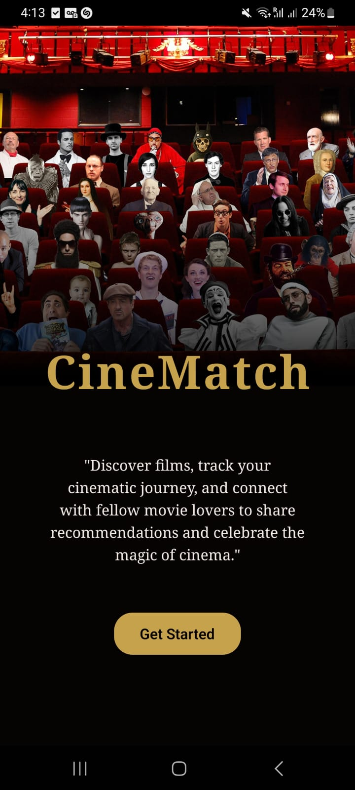
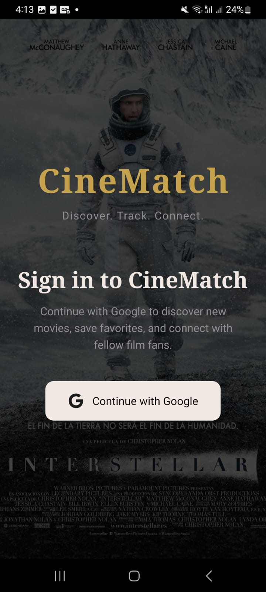
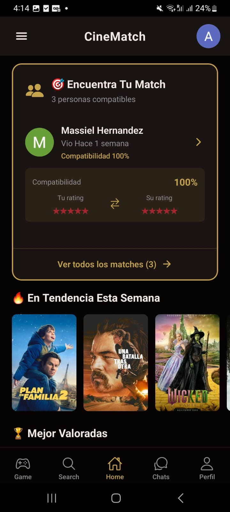
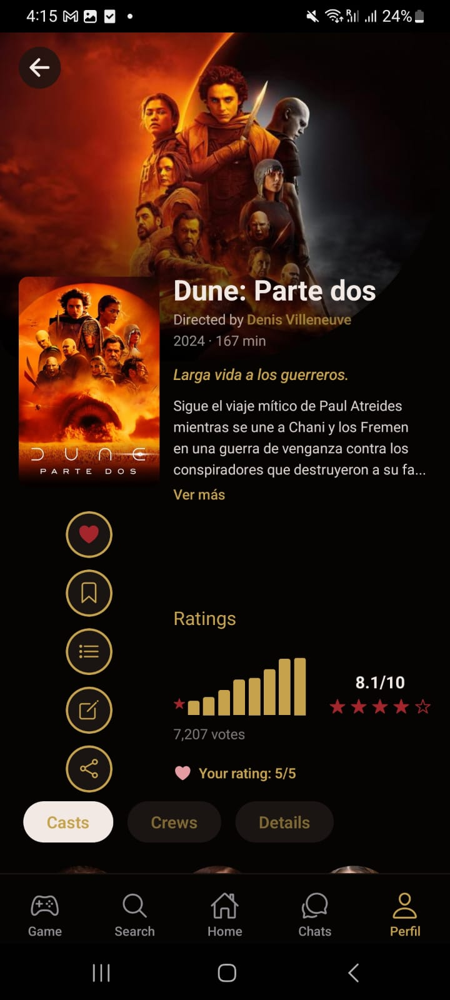
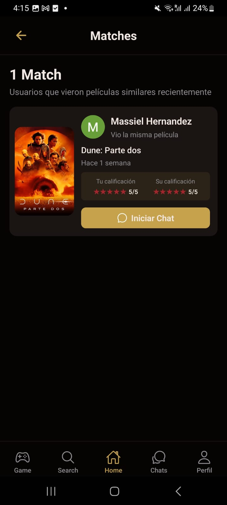
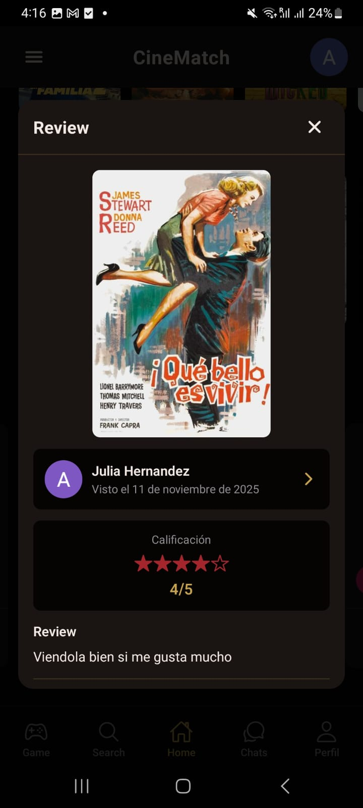
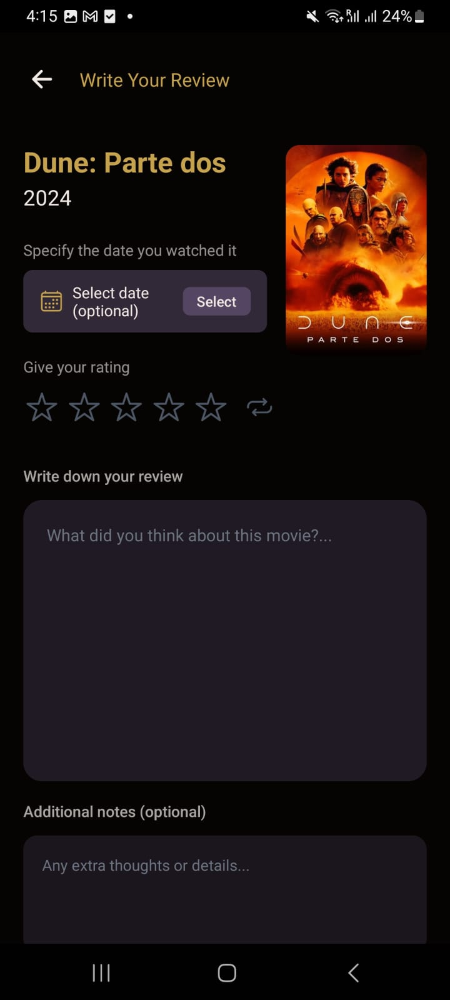
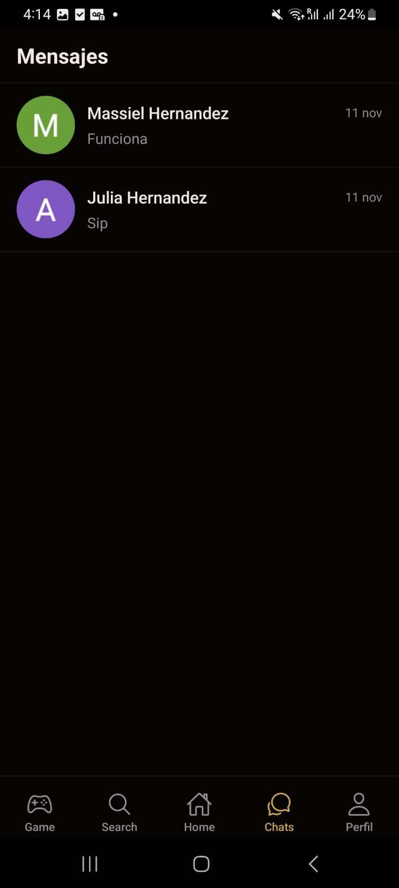
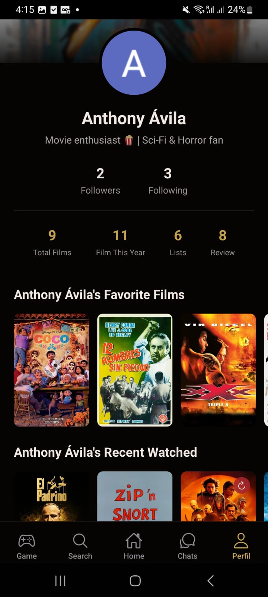

<div align="center">
  
# 🎬 CineMatch

### _Discover. Track. Connect._

**A modern social platform for movie enthusiasts to discover films, track their cinematic journey, and connect with fellow movie lovers.**

[](https://reactnative.dev/)
[](https://www.typescriptlang.org/)
[](https://firebase.google.com/)

</div>

---

## 📱 About CineMatch

CineMatch is a comprehensive mobile application that combines the power of movie discovery with social networking. Built with React Native and TypeScript, it provides a seamless cross-platform experience for iOS and Android users who want to explore movies, share their opinions, and find like-minded cinephiles.

### ✨ Key Features

- 🎯 **Smart Match System** - Find users with similar taste based on your movie ratings
- 📊 **Movie Discovery** - Explore trending and top-rated films from TMDB
- 📝 **Diary & Reviews** - Log and review the movies you watch
- 👥 **Social Feed** - See what your friends are watching and their ratings
- 💬 **Real-time Chat** - Connect and discuss movies with your matches
- ⭐ **Rating System** - Rate movies with a beautiful star-based interface
- 🔐 **Secure Authentication** - Google Sign-In integration

---

## 🎨 Screenshots

<div align="center">

### Welcome & Authentication




_Elegant onboarding and secure Google authentication_

### Home & Discovery




_Browse trending movies and explore detailed information with cast, crew, and reviews_

### Social Features




_Find compatible movie lovers and read your friends' detailed reviews_

### Personal Tracking




_Track your cinematic journey with beautiful diary entries and star ratings_

### Communication & Profile




_Real-time messaging and personalized user profiles_

</div>

---

## 🏗️ Architecture & Tech Stack

### Frontend

- **React Native** - Cross-platform mobile framework
- **TypeScript** - Type-safe development
- **React Navigation** - Navigation system with stack and tab navigators
- **React Context API** - Global state management for authentication

### Backend & Services

- **Firebase Authentication** - Secure user authentication with Google Sign-In
- **Cloud Firestore** - Real-time NoSQL database for user data, reviews, and chats
- **TMDB API** - The Movie Database API for movie information and images
- **Custom REST API** - Backend service for matches, activity feeds, and media caching

### UI/UX

- **React Native Vector Icons** - Beautiful iconography
- **React Native Linear Gradient** - Smooth gradient backgrounds
- **Custom Components** - Reusable UI components with consistent theming

---

## 🚀 Core Functionality

### 🎯 Smart Matching Algorithm

The app features an intelligent matching system that analyzes user ratings to find compatible movie enthusiasts:

- **Compatibility Score** - Calculated based on rating similarity and recency
- **Shared Movies** - Displays common movies between users
- **Rating Comparison** - Visual star-based comparison of your ratings vs theirs

### 📊 Movie Discovery

Browse and explore movies with:

- **Trending Section** - Weekly trending movies
- **Top Rated** - Highly acclaimed films
- **Detailed Information** - Cast, crew, ratings, and synopsis
- **User Reviews** - See what the community thinks

### 📝 Diary System

Track your cinematic journey:

- **Watch Logging** - Record when you watched a movie
- **Star Ratings** - Rate from 1-5 stars with half-star precision
- **Written Reviews** - Share your detailed thoughts
- **Visual Timeline** - Chronological view of your watched movies

### 👥 Social Features

Connect with the movie community:

- **Friends Activity Feed** - Real-time updates on what friends are watching
- **Review Modal** - Detailed view of user reviews with ratings
- **User Profiles** - Explore other users' favorite films and recent activity
- **Follow System** - Build your network of movie enthusiasts

### 💬 Real-time Messaging

Communicate seamlessly:

- **Direct Chats** - One-on-one conversations with matches
- **Firebase Realtime** - Instant message delivery
- **Chat History** - Persistent conversation storage

---

## 🛠️ Technical Highlights

### Type Safety

The entire codebase leverages TypeScript for:

- **Interface Definitions** - Strongly typed data structures
- **Type Guards** - Runtime type checking
- **Generic Utilities** - Reusable type-safe functions

### Performance Optimization

- **Lazy Loading** - Components and images load on demand
- **Memoization** - Optimized re-renders with React hooks
- **Efficient Lists** - FlatList implementation for smooth scrolling
- **Image Caching** - TMDB image URLs with optimized resolutions

### Code Organization

```
src/
├── components/        # Reusable UI components
│   ├── home/         # Home screen widgets
│   ├── movies/       # Movie-related components
│   ├── matches/      # Matching system UI
│   └── ui/           # Generic UI elements
├── screens/          # Screen components
├── navigation/       # Navigation configuration
├── services/         # API and Firebase services
├── hooks/           # Custom React hooks
├── context/         # React Context providers
├── types/           # TypeScript type definitions
└── utils/           # Helper functions
```

---

## 📦 Installation & Setup

### Prerequisites

- Node.js (v16 or higher)
- React Native development environment
- Android Studio (for Android) or Xcode (for iOS)
- Firebase project configuration

### Clone & Install

```bash
# Clone the repository
git clone https://github.com/Anthonyah131/CineMatch.git

# Navigate to project directory
cd CineMatch

# Install dependencies
npm install

# iOS only - Install CocoaPods
cd ios && pod install && cd ..
```

### Environment Setup

Create a `.env` file with your API keys:

```env
TMDB_API_KEY=your_tmdb_api_key
FIREBASE_API_KEY=your_firebase_api_key
# ... other Firebase config
```

### Run the App

```bash
# Start Metro bundler
npm start

# Run on Android
npm run android

# Run on iOS
npm run ios
```

---

## 🎯 Future Enhancements

- [ ] **Watchlist** - Save movies to watch later
- [ ] **Advanced Filters** - Genre, year, rating filters
- [ ] **Movie Recommendations** - AI-powered suggestions
- [ ] **Group Chats** - Discuss movies with multiple users
- [ ] **Achievements** - Gamification with badges and milestones
- [ ] **Export Diary** - Download your movie log

---

## 👨‍💻 Developer

**Anthony Ávila**

- GitHub: [@Anthonyah131](https://github.com/Anthonyah131)

---

## 📄 License

This project is licensed under the MIT License - see the LICENSE file for details.

---

## 🙏 Acknowledgments

- **TMDB** - For the comprehensive movie database API
- **React Native Community** - For the amazing framework and tools
- **Firebase** - For backend infrastructure
- **Ionicons** - For beautiful icons

---

<div align="center">

### ⭐ Star this repo if you find it useful!

**Made with ❤️ and ☕ for movie lovers everywhere**

</div>
